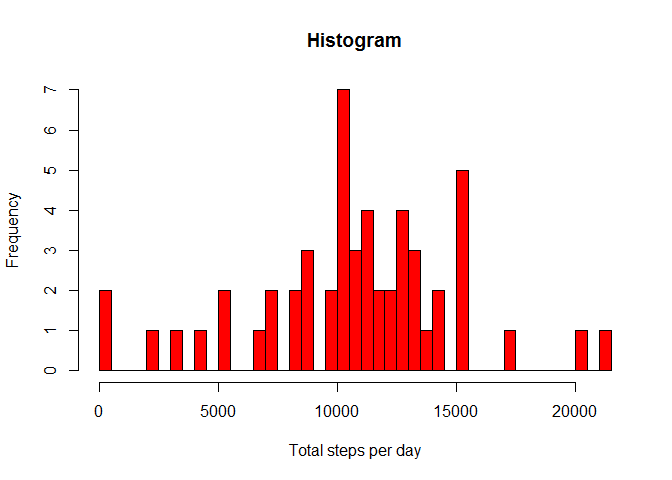
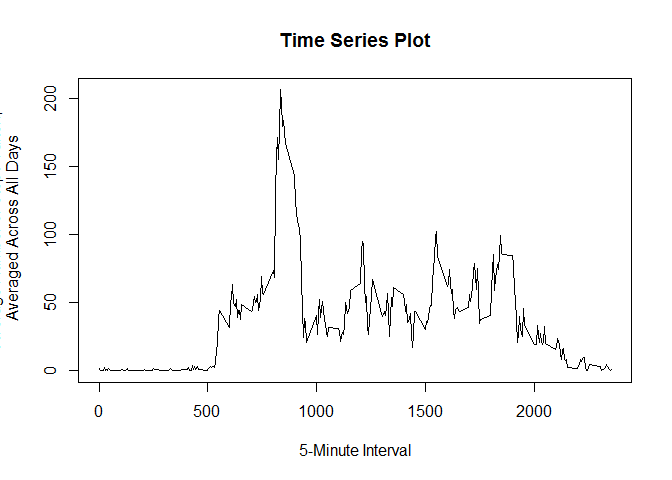
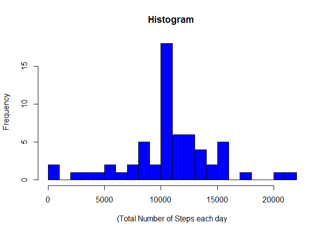
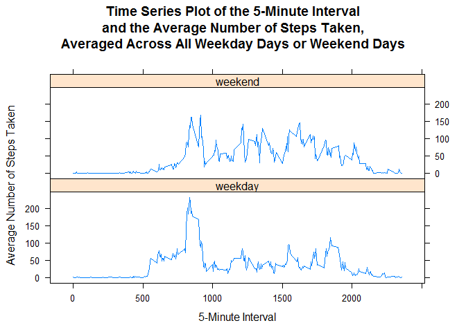

# Reproducible Research: Peer Assessment 1


## Loading and preprocessing the data

```r
unzip('activity.zip')
activity_data <- read.csv('activity.csv')
```
## What is mean total number of steps taken per day?

```r
total_steps<- aggregate(steps~date,activity_data,sum,rm.na = TRUE)
hist(total_steps$steps,breaks = 40, xlab='Total steps per day',main = 'Histogram',col = 'Red' )
```

<!-- -->

### Mean and Median of total number of steps taken per day

```r
mean_steps <- mean(total_steps$steps)
median_steps <- median(total_steps$steps)
mean_steps
```

```
## [1] 10767.19
```

```r
median_steps
```

```
## [1] 10766
```

## What is the average daily activity pattern?

```r
interval <- aggregate(steps ~ interval, activity_data, mean,rm.na = TRUE)
plot(
        x = interval$interval,
        y = interval$steps,
        type = "l",
        main = "Time Series Plot",
        xlab = "5-Minute Interval",
        ylab = "Average Number of Steps Taken,\n Averaged Across All Days"
)
```

<!-- -->


```r
interval[interval$steps==max(interval$steps),]
```

```
##     interval    steps
## 104      835 206.1698
```

## Imputing missing values

```r
nrow(activity_data[is.na(activity_data$steps),])
```

```
## [1] 2304
```

```r
names(interval)[2] <- "mean_steps"
newactivity <- merge(activity_data, interval, by = 'interval')
newactivity$steps[is.na(newactivity$steps)] <- as.integer(
        round(newactivity$mean_steps[is.na(newactivity$steps)]))
newactivity1<-newactivity[,1:3]
## (total number of (steps taken per day))
newtotal <- aggregate(steps ~ date, newactivity1, sum)
hist(
        newtotal$steps,
        col = "blue",
        main = "Histogram ",
        xlab = "(Total Number of Steps each day",
        breaks = 20
)
```

<!-- -->

```r
mean_steps <- mean(newtotal$steps)
median_steps <- median(newtotal$steps)
mean_steps
```

```
## [1] 10765.64
```

```r
median_steps
```

```
## [1] 10762
```

## Are there differences in activity patterns between weekdays and weekends?

```r
weekend <- weekdays(as.Date(newactivity1$date)) %in% c("Saturday", "Sunday")
newactivity1$daytype <- "weekday"
newactivity1$daytype[weekend == TRUE] <- "weekend"
newactivity1$daytype <- as.factor(newactivity1$daytype)
```


```r
newinterval <- aggregate(steps ~ interval + daytype, newactivity1, mean)
library(lattice)
xyplot(
        steps ~ interval | daytype,
        newinterval,
        type = "l",
        layout = c(1,2),
        main = "Time Series Plot of the 5-Minute Interval\nand the Average Number of Steps Taken,\nAveraged Across All Weekday Days or Weekend Days",
        xlab = "5-Minute Interval",
        ylab = "Average Number of Steps Taken"
)
```

<!-- -->
